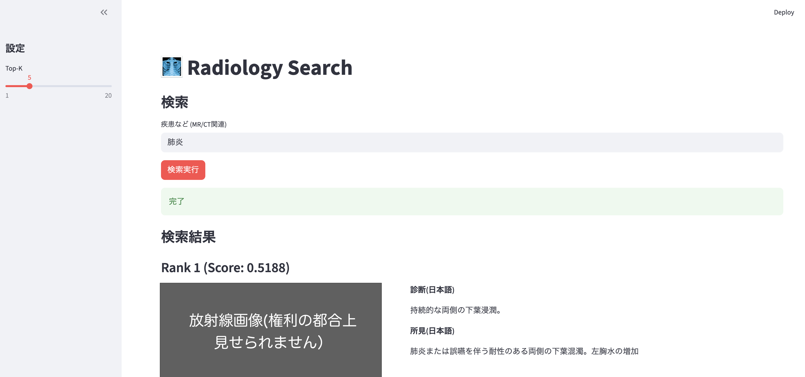

# DH
## 授業名
- 文理共創科目：デジタル・ヒューマニティーズを支えるAIの設計思想と技術
- Collaboration across STEM and Liberal Arts:AI design concept and technology that supports digital humanities

# アプリについて
## 概要
- CT, MRI画像に関する疾患について検索することで、データ上でそれに近い読影レポートを例示する

## 参考文献
- [FUJIFILM 読影レポート構造化](https://www.fujifilm.com/jp/ja/news/list/12205)

## アプリ使用例
 

# 使い方
## (1) データセットを用意する
### 読影レポートを用意
- 必要なカラム（それぞれの症例に対するレポート）
    - image_name : CT, MRIの画像, JPGやPNG推奨。DICOM形式はエラーが起こる
    - image_path : 画像の保存されているpath
    - findings_jp : 日本語の初見
    - impression_jp : 日本語の診断結果
- 保存先
    - csvファイル
    - ./data/csv/に保存

## (2) 環境を作成する
1. uvをinstall
2. uv環境を作成
```
uv sync
```
3. .envをfolderの直下に作成し、OPENAI_KEYを保存する
```
OPENAI_API_KEY="your_key"
```

## (3) 読影レポート埋め込みを作成する(embedding)
- create_emb.ipynbを実行。./data/embに全てのレポートにタウするembeddingが生成される

## (4) アプリケーションを実行する
```
. .venv/bin/active
streamlit run main.py
```
